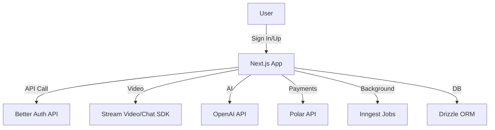
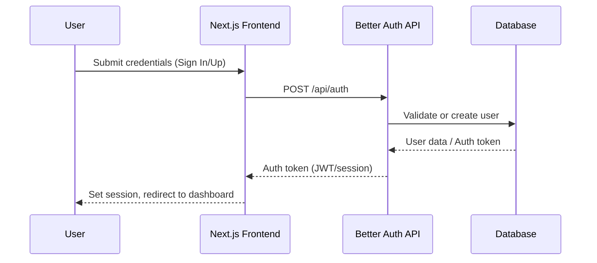
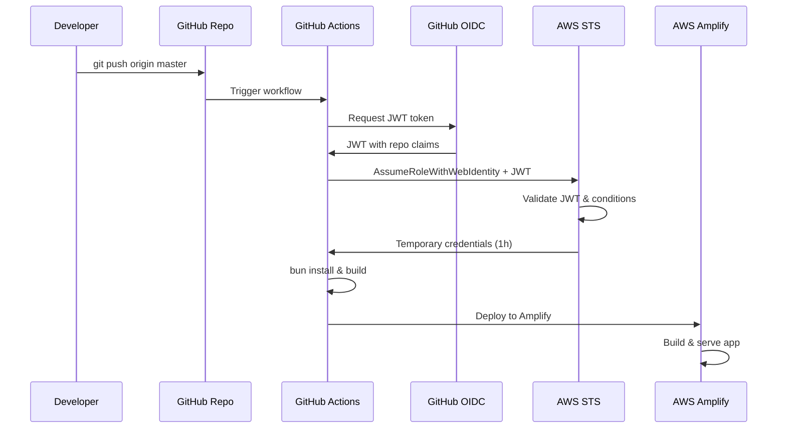

# Meet AI Platform 🚀

Next-generation video conferencing powered by AI: smarter, more productive, and effortlessly organized.

---

## 🌟 Features


| Core Functionality      | AI Capabilities         |
| ----------------------- | ----------------------- |
| AI-Powered Video Calls  | Custom Real-time Agents |
| Smart Meeting Summaries | AI Q&A                  |
| Meeting Recordings      | OpenAI Integration      |
| Transcript Search       | Smart Transcripts       |

---

## 🛠️ Technical Stack

| Layer         | Technology                            |
| ------------- | ------------------------------------- |
| Frontend      | Next.js 15, React 19, Tailwind CSS v4 |
| UI Components | shadcn/ui                             |
| Auth          | Better Auth                           |
| Real-time     | Stream Video SDK, Stream Chat SDK     |
| Background    | Inngest (background jobs)             |
| Payments      | Polar subscriptions                   |
| DB/ORM        | Drizzle ORM                           |
| Package Mgmt  | Bun, npm, or yarn                     |
| Deploy        | AWS Amplify                           |

---

## 📐 Architecture Overview



---

## 🔐 Authentication Flow



---

## 📦 Endpoints principales (API)

| Endpoint                      | Método | Descripción                      |
| ----------------------------- | ------ | -------------------------------- |
| `/api/auth/sign-in`           | POST   | Login de usuario                 |
| `/api/auth/sign-up`           | POST   | Registro de usuario              |
| `/api/meetings`               | GET    | Listar reuniones                 |
| `/api/meetings`               | POST   | Crear nueva reunión              |
| `/api/meetings/:id`           | GET    | Obtener detalles de reunión      |
| `/api/meetings/:id/summary`   | GET    | Obtener resumen AI de la reunión |
| `/api/meetings/:id/recording` | GET    | Descargar grabación              |
| `/api/payments/subscribe`     | POST   | Suscribirse vía Polar            |

---

## ⚙️ Variables de entorno

Configura tus variables en `.env.local`:

| Variable             | Descripción                          |
| -------------------- | ------------------------------------ |
| `STREAM_API_KEY`     | Credencial de Stream Video/Chat      |
| `STREAM_API_SECRET`  | Secreto de Stream Video/Chat         |
| `OPENAI_API_KEY`     | Clave de OpenAI                      |
| `BETTER_AUTH_SECRET` | Secreto para Better Auth             |
| `POLAR_API`          | Clave para pagos con Polar           |
| ...                  | Ver `.env.example` para más detalles |

---

## 🚀 Getting Started

### Prerequisitos

- Node.js 18+
- Bun (opcional, recomendado)
- npm o yarn
- Credenciales de Stream
- API Key de OpenAI

### Instalación

```bash
# Clona el repositorio
git clone https://github.com/LostoVayne/meet-ai-platform.git
cd meet-ai-platform

# Instala dependencias (elige uno)
bun install
# o
npm install
# o
yarn

# Configura variables de entorno
cp .env.example .env.local

# Inicia el servidor de desarrollo
bun dev
# o
npm run dev
# o
yarn dev
```

---

## 🚀 Deploy en AWS Amplify con GitHub Actions (OIDC)

### Arquitectura de despliegue



### 🔧 Configuración paso a paso

#### 1. **Crear aplicación en AWS Amplify**

```bash
# Configurar AWS CLI (si no está configurado)
aws configure

# Crear aplicación Amplify
aws amplify create-app \
  --name "tu-proyecto-name" \
  --description "Next.js 15 app with AI features" \
  --platform WEB \
  --custom-rules '[{"source":"/<*>","status":"404-200","target":"/index.html"}]' \
  --region us-east-1
```

**Guarda el `appId` que devuelve el comando anterior.**

#### 2. **Configurar OIDC Identity Provider**

```bash
# Crear OIDC provider para GitHub Actions
aws iam create-open-id-connect-provider \
  --url https://token.actions.githubusercontent.com \
  --client-id-list sts.amazonaws.com \
  --thumbprint-list 6938fd4d98bab03faadb97b34396831e3780aea1,1c58a3a8518e8759bf075b76b750d4f2df264fcd \
  --region us-east-1
```

#### 3. **Crear política de permisos**

```bash
# Crear archivo de política (reemplaza TU_APP_ID)
cat > amplify-policy.json << 'EOF'
{
  "Version": "2012-10-17",
  "Statement": [
    {
      "Effect": "Allow",
      "Action": [
        "amplify:CreateDeployment",
        "amplify:GetDeployment",
        "amplify:StartDeployment",
        "amplify:GetApp",
        "amplify:GetBranch",
        "amplify:ListApps"
      ],
      "Resource": [
        "arn:aws:amplify:us-east-1:*:apps/TU_APP_ID",
        "arn:aws:amplify:us-east-1:*:apps/TU_APP_ID/*"
      ]
    }
  ]
}
EOF

# Crear la política
aws iam create-policy \
  --policy-name GitHubActionsAmplifyPolicy \
  --policy-document file://amplify-policy.json \
  --description "Policy for GitHub Actions to deploy to Amplify"
```

#### 4. **Crear rol IAM con trust policy**

```bash
# Crear trust policy (reemplaza TU_USUARIO/TU_REPO)
cat > github-trust-policy.json << 'EOF'
{
  "Version": "2012-10-17",
  "Statement": [
    {
      "Effect": "Allow",
      "Principal": {
        "Federated": "arn:aws:iam::TU_ACCOUNT_ID:oidc-provider/token.actions.githubusercontent.com"
      },
      "Action": "sts:AssumeRoleWithWebIdentity",
      "Condition": {
        "StringEquals": {
          "token.actions.githubusercontent.com:aud": "sts.amazonaws.com"
        },
        "StringLike": {
          "token.actions.githubusercontent.com:sub": "repo:TU_USUARIO/TU_REPO:*"
        }
      }
    }
  ]
}
EOF

# Crear el rol
aws iam create-role \
  --role-name GitHubActionsAmplifyRole \
  --assume-role-policy-document file://github-trust-policy.json \
  --description "Role for GitHub Actions to deploy to Amplify"

# Adjuntar la política al rol (reemplaza TU_ACCOUNT_ID)
aws iam attach-role-policy \
  --role-name GitHubActionsAmplifyRole \
  --policy-arn arn:aws:iam::TU_ACCOUNT_ID:policy/GitHubActionsAmplifyPolicy
```

#### 5. **Obtener tu Account ID**

```bash
# Obtener tu AWS Account ID
aws sts get-caller-identity --query Account --output text
```

#### 6. **Configurar GitHub Secrets**

Ve a tu repositorio en GitHub: **Settings** → **Secrets and variables** → **Actions** → **New repository secret**

Agrega estos 3 secrets obligatorios:

| Secret Name       | Descripción                     | Cómo obtenerlo                                             |
| ----------------- | ------------------------------- | ---------------------------------------------------------- |
| `AWS_ROLE_ARN`    | ARN del rol IAM creado          | `arn:aws:iam::TU_ACCOUNT_ID:role/GitHubActionsAmplifyRole` |
| `AMPLIFY_APP_ID`  | ID de tu aplicación Amplify     | Se obtiene al crear la app con `aws amplify create-app`    |
| `AMPLIFY_APP_URL` | URL de tu aplicación desplegada | `https://TU_APP_ID.amplifyapp.com`                         |

**Ejemplo de valores:**

```
AWS_ROLE_ARN = arn:aws:iam::123456789012:role/GitHubActionsAmplifyRole
AMPLIFY_APP_ID = d1a2b3c4d5e6f7
AMPLIFY_APP_URL = https://d1a2b3c4d5e6f7.amplifyapp.com
```

#### 7. **GitHub Action optimizado**

El archivo `.github/workflows/amplify-deploy.yml` ya incluye optimizaciones:

- ✅ **Concurrencia**: Evita múltiples deploys simultáneos
- ✅ **Cache**: Acelera instalación de dependencias con Bun
- ✅ **Timeout**: Limita ejecución a 15 minutos
- ✅ **Cleanup**: Limpia archivos temporales automáticamente
- ✅ **Triggers**: Se ejecuta en push y PR a master
- ✅ **Secrets**: Usa variables seguras (no valores hardcodeados)
- ✅ **Logs**: Feedback claro del proceso de deploy

#### 8. **Configurar variables de entorno (opcional)**

```bash
# Agregar variables de entorno adicionales a tu app
aws amplify put-app \
  --app-id $AMPLIFY_APP_ID \
  --environment-variables NEXT_PUBLIC_APP_URL=https://$AMPLIFY_APP_ID.amplifyapp.com \
  --region us-east-1
```

### 🔐 Ventajas de este setup

### 🔐 Ventajas de este setup

- ✅ **Sin secretos**: No necesitas AWS_ACCESS_KEY_ID ni AWS_SECRET_ACCESS_KEY
- ✅ **Seguro**: Credenciales temporales que expiran automáticamente
- ✅ **Granular**: Solo tu repositorio puede desplegar
- ✅ **Automático**: Deploy en cada push a master
- ✅ **Auditable**: Todos los accesos quedan en CloudTrail

### 🚀 Uso

1. Haz push a la rama `master`
2. GitHub Actions se ejecuta automáticamente
3. Tu app se despliega en `https://TU_APP_ID.amplifyapp.com`

### 📋 Checklist de configuración

- [ ] AWS CLI configurado
- [ ] Aplicación Amplify creada
- [ ] OIDC Provider configurado
- [ ] Política IAM creada
- [ ] Rol IAM creado y política adjuntada
- [ ] GitHub Action actualizado con tus valores
- [ ] Variables de entorno configuradas
- [ ] Push a master para probar

### 📁 Archivo amplify.yml

El proyecto incluye un archivo `amplify.yml` preconfigurado para Bun + Next.js 15:

```yaml
version: 1
frontend:
  phases:
    preBuild:
      commands:
        - curl -fsSL https://bun.sh/install | bash
        - export PATH="$HOME/.bun/bin:$PATH"
        - bun install
    build:
      commands:
        - export PATH="$HOME/.bun/bin:$PATH"
        - bun run build
  artifacts:
    baseDirectory: .next
    files:
      - "**/*"
  cache:
    paths:
      - node_modules/**/*
      - .next/cache/**/*
```

### 🔧 Comandos de configuración rápida

```bash
# 1. Clonar y configurar proyecto
git clone https://github.com/TU_USUARIO/TU_REPO.git
cd TU_REPO
cp .env.example .env.local

# 2. Obtener tu Account ID
ACCOUNT_ID=$(aws sts get-caller-identity --query Account --output text)
echo "Tu Account ID: $ACCOUNT_ID"

# 3. Crear aplicación Amplify
APP_ID=$(aws amplify create-app \
  --name "meet-ai-platform" \
  --description "Next.js 15 video conferencing platform with AI" \
  --platform WEB \
  --custom-rules '[{"source":"/<*>","status":"404-200","target":"/index.html"}]' \
  --region us-east-1 \
  --query 'app.appId' \
  --output text)

echo "Tu App ID: $APP_ID"
echo "Tu URL: https://$APP_ID.amplifyapp.com"

# 4. Configurar OIDC y permisos (ejecutar uno por uno)
aws iam create-open-id-connect-provider \
  --url https://token.actions.githubusercontent.com \
  --client-id-list sts.amazonaws.com \
  --thumbprint-list 6938fd4d98bab03faadb97b34396831e3780aea1,1c58a3a8518e8759bf075b76b750d4f2df264fcd

# 5. Crear archivos de políticas
cat > amplify-policy.json << EOF
{
  "Version": "2012-10-17",
  "Statement": [
    {
      "Effect": "Allow",
      "Action": [
        "amplify:CreateDeployment",
        "amplify:GetDeployment",
        "amplify:StartDeployment",
        "amplify:GetApp",
        "amplify:GetBranch",
        "amplify:ListApps"
      ],
      "Resource": [
        "arn:aws:amplify:us-east-1:\$ACCOUNT_ID:apps/\$APP_ID",
        "arn:aws:amplify:us-east-1:\$ACCOUNT_ID:apps/\$APP_ID/*"
      ]
    }
  ]
}
EOF

cat > github-trust-policy.json << EOF
{
  "Version": "2012-10-17",
  "Statement": [
    {
      "Effect": "Allow",
      "Principal": {
        "Federated": "arn:aws:iam::\$ACCOUNT_ID:oidc-provider/token.actions.githubusercontent.com"
      },
      "Action": "sts:AssumeRoleWithWebIdentity",
      "Condition": {
        "StringEquals": {
          "token.actions.githubusercontent.com:aud": "sts.amazonaws.com"
        },
        "StringLike": {
          "token.actions.githubusercontent.com:sub": "repo:TU_USUARIO/TU_REPO:*"
        }
      }
    }
  ]
}
EOF

# 6. Crear política y rol
aws iam create-policy \
  --policy-name GitHubActionsAmplifyPolicy \
  --policy-document file://amplify-policy.json

aws iam create-role \
  --role-name GitHubActionsAmplifyRole \
  --assume-role-policy-document file://github-trust-policy.json

aws iam attach-role-policy \
  --role-name GitHubActionsAmplifyRole \
  --policy-arn arn:aws:iam::\$ACCOUNT_ID:policy/GitHubActionsAmplifyPolicy

# 7. Actualizar GitHub Action con tus valores
echo "Actualiza .github/workflows/amplify-deploy.yml con:"
echo "- Account ID: \$ACCOUNT_ID"
echo "- App ID: \$APP_ID"
echo "- URL: https://\$APP_ID.amplifyapp.com"
```

---

## 🧩 Uso de shadcn/ui

- Componentes reutilizables en `src/components/ui/`.
- Ejemplo:

```tsx
import { Button } from "@/components/ui/button";

<Button variant="primary">Iniciar reunión</Button>;
```

---

## 🔑 Better Auth

- Autenticación segura y moderna.
- Flujos en `src/app/(auth)/sign-in` y `sign-up`.
- Vistas personalizadas en `src/modules/auth/ui/views/`.

---

## 💳 Polar (Pagos y Suscripciones)

- Integración con Polar para suscripciones y pagos.
- Configura tu clave en las variables de entorno.
- El flujo de pago se maneja desde el dashboard.

---

## 📚 Reglas y buenas prácticas

- Usa **Bun** para desarrollo rápido y eficiente.
- Sigue la convención de carpetas de Next.js (app router).
- Componentes UI en `src/components/ui/`.
- Hooks personalizados en `src/hooks/`.
- Mantén dependencias actualizadas.
- Usa ESLint y Prettier para mantener el código limpio.
- No subas claves ni secretos al repositorio.

---

## 🧪 Testing

- Próximamente: integración con Jest y pruebas E2E.

---

## 🤝 Contribuir

1. Haz un fork del repositorio.
2. Crea una rama para tu feature/fix.
3. Haz un PR describiendo tus cambios.

---

## 📞 Soporte

¿Dudas o sugerencias? Abre un issue o contacta a [Lostovayne](https://github.com/LostoVayne).

---

## 📝 Licencia

Este proyecto está bajo la Licencia MIT. Consulta el archivo [LICENSE](./LICENSE) para más detalles.
